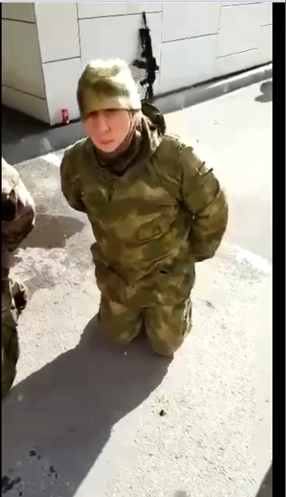
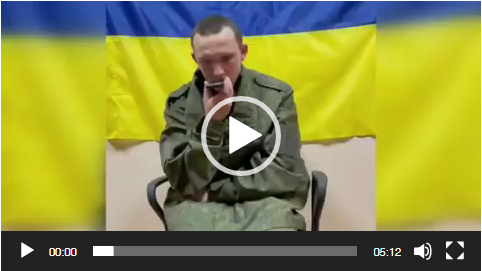
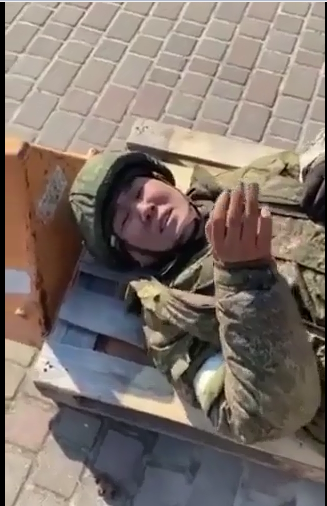

# Drodzy Rosjanie.
Pewnie zauważyliście zmiany, które dokonały się od 24 lutego 2022. Są niczym w porównaniu do  zmian na Ukrainie.  24 lutego 2022 o 3.45 Władimir Putin wydał rozkaz przeprowadzenia "specjalnej operacji wojskowej na terenie Ukrainy". Jak twierdzi prezydent Rosji musiał pomóc obywatelom Ukrainy, chronić ich. Napadając nad ranem, gdy wszyscy spali, bez uprzedzenia. Czy ten ruch ci czegoś nie przypomina? Czy tak nie postąpił Hitler 1 września 1939 w Polsce? Czy ten ruch nie jest nazistowski? Czy tak ma wyglądać pomoc? 

Wybuchy słychać było nad ranem na obrzeżach Kijowa, w Charkowie, ale także m.in. w obwodzie lwowskim na zachodzie Ukrainy. Wkrótce jednak okazało się że atakowana jest zarówno infrastruktura wojskowa, jak i obiekty cywilne. 
Wysłał zwerbowanych młodych żołnierzy, którym wmówił, iż są to ćwiczenia. Wysłał ich jak mięso armatnie. Bez doświadczenia, prowiantu i starymi czołgami. Młodzi Rosjanie dopiero na miejscu uświadomili sobie, że to oni napadają.
 

Wojska Putina bombardują miasta. Nie patrząc na ludność cywilną. Bombardowane są przedszkola, szkoły a nawet szpitale. W Ługański wojska rosyjskie zajęły szpital, który próbowali odbić Ukraińcy. Nawet z tego putin potrafił zrobić propagandę. Pokazując, że to wojska Ukraińskie ostrzeliwują szpital. 
Tak teraz wygląda przedszkole.
.

Prezydent Zalenski prosił o korytarze humanitarne i zawieszenie broni, by ludność mogła się 
ewakuować. Zgadnij co zrobił putin. Kazał strzelać do cywili.

A co jest pokazywane w rosyjskich mediach, że wyzwalają Ukrainę, że Ukraińcy dziękują za wyzwolenie.
Wszystko to to nie prawda. Jesteście karmieni propagandowymi filmami. Czemu nie ma niezależnych mediów. Czemu są blokowane strony internetowe, które pokazują prawdę.
Niestety prezydent Rosji mocno kontroluje co zostanie wyemitowane i przekazane, ludzie żyją w niewiedzy. Ty , rosyjski obywatelu, żyjesz w niewiedzy. Władimir Putin wcale nie ocala obywateli Ukrainy , giną cywile , dzieci.
 
Dlatego Europa, Świat zjednoczyli się by pomóc Ukrainie. 

11 marca 2022 rząd putinowski chce wyłączyć wam globalny internet. Od tego dnia już całkiem będzie kontrolował wasze życie.

W Mariupolu cywile wychodzą i stają na przeciw nadjeżdżającym czołgom. Bez broni są wstanie zatrzymać czołg  Nie boją się umrzeć. Bo czym, że jest śmierć wobec wolności. 

A czemu Wy  Rosjanie,czemu Wy nie wychodzicie nie możecie protestować. Bo Putinowi nie podoba się prawda. Dlatego straszy Was 15 latami więzienia. Za prawdę? Obalcie jego dyktaturę. To on kreuje Wam rzeczywistość. 

Nie wychodź sam. Wyjdźcie w dużej ilości. Dopiero jak będzie Was dużo będzie w Was siła. Wtedy zacznijcie protestować. Niech ten protest nie będzie tylko sprzeciwem wobec Wojny na Ukrainie ale też sprzeciwem wobec rządów Putina. Wobec wolności słowa i demokracji.  
