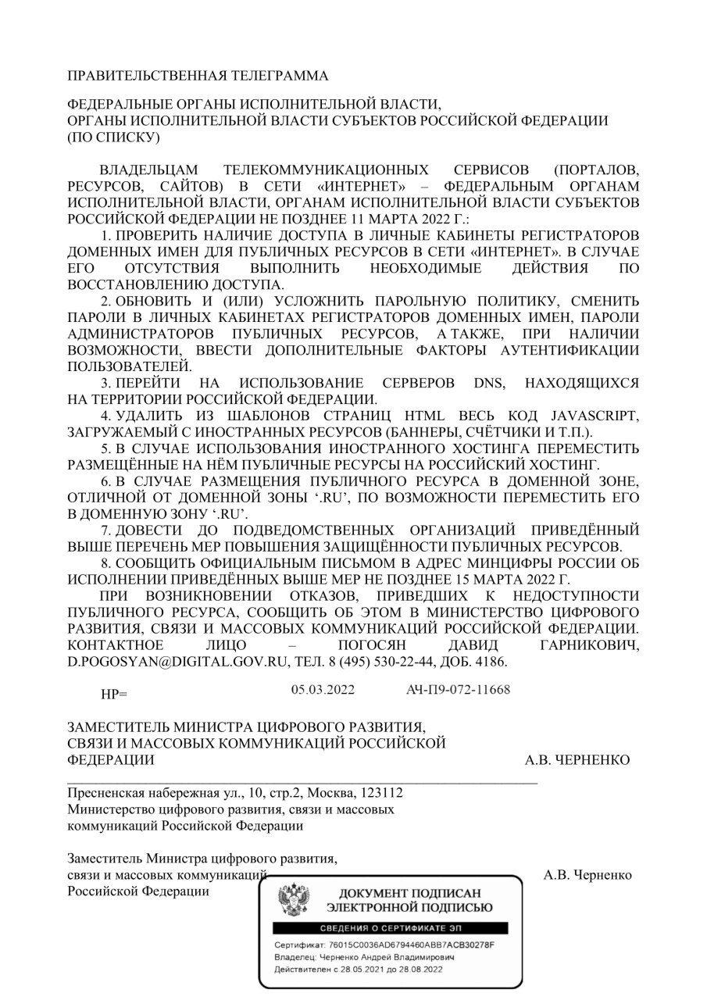
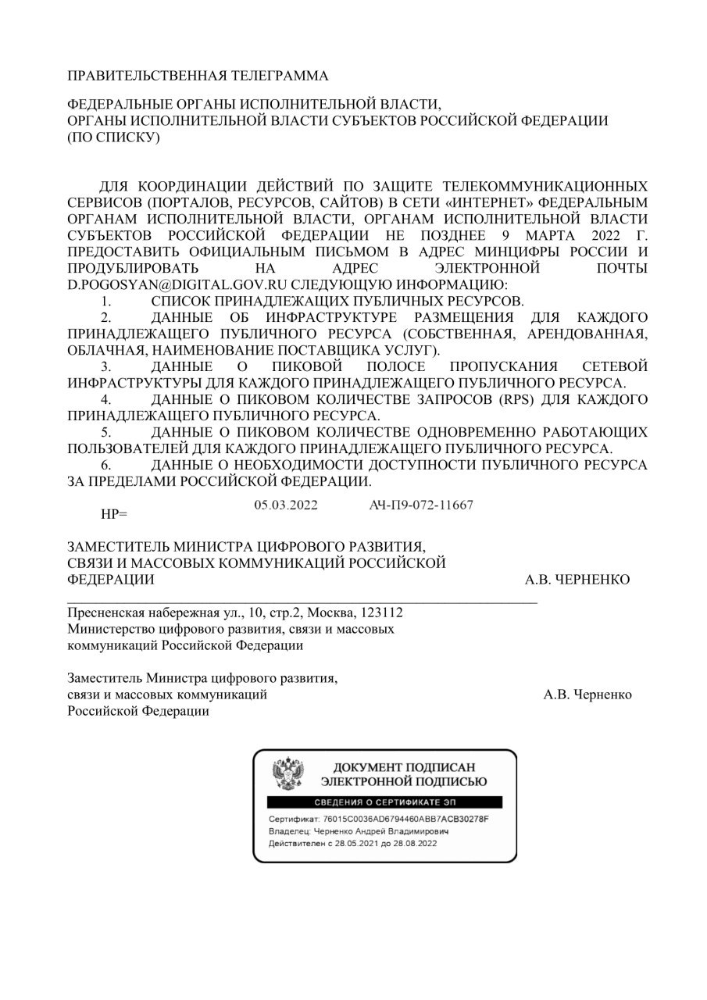

# Drodzy Rosjanie.

(pliki są na github aby putin nie zablokował, więc jeśli chcesz obejrzeć filmik musisz kliknąć w obrazek)

Nie da się nie zauważyć zmian które nastąpiły 24 lutego 2022.
 24 lutego 2022 o 3.45 Władimir Putin wydał rozkaz przeprowadzenia "specjalnej operacji wojskowej na terenie Ukrainy". Jak twierdzi prezydent Rosji musiał pomóc obywatelom Ukrainy, chronić ich. Napadając nad ranem, gdy wszyscy spali, bez uprzedzenia. Czy ten ruch ci czegoś nie przypomina? Czy tak nie postąpił Hitler 1 września 1939 w Polsce? Czy ten ruch nie jest nazistowski? Czy tak ma wyglądać pomoc?

https://user-images.githubusercontent.com/101053692/157276317-b5d0931f-8d85-4e56-bc26-63110704281a.mp4

Wybuchy słychać było nad ranem na obrzeżach Kijowa, w Charkowie, ale także m.in. w obwodzie lwowskim na zachodzie Ukrainy. Wkrótce jednak okazało się że atakowana jest zarówno infrastruktura wojskowa, jak i obiekty cywilne. Wysłał zwerbowanych młodych żołnierzy, którym wmówił, iż są to ćwiczenia. Wysłał ich jak mięso armatne. Bez doświadczenia, prowiantu i starymi czołgami. Młodzi Rosjanie dopiero na miejscu uświadomili sobie, że to oni napadają.

https://user-images.githubusercontent.com/101053692/157274497-ef5f4a57-e541-40d0-a11f-3042efe006da.mp4

https://user-images.githubusercontent.com/101053692/157274650-30ae144b-f06b-4edb-81ea-895e71bf032c.mp4

https://user-images.githubusercontent.com/101053692/157274841-6458865b-f4d1-4e8d-9f68-6d682c6cc9d8.mp4

Wojska Putina bombardują miasta. Nie patrząc na ludność cywilną. Bombardowane są przedszkola, szkoły a nawet szpitale. W Ługańsku wojska rosyjskie zajęły szpital, który próbowali odbić Ukraińcy. Nawet z tego Putin potrafił zrobić propagandę, pokazując, że to wojska Ukraińskie ostrzeliwują własny  szpital. Tak teraz wyglądają przedszkola.
Prezydent Zelenski prosił o korytarze humanitarne i zawieszenie broni, by ludność mogła się ewakuować. Zgadnij co zrobił putin? Kazał strzelać do cywili.

Jesteście karmieni propagandowymi filmami. Czemu nie ma niezależnych mediów. Czemu są blokowane strony internetowe, które pokazują prawdę. Niestety prezydent Rosji mocno kontroluje co zostanie wyemitowane i przekazane, ludzie żyją w niewiedzy. Ty , rosyjski obywatelu, żyjesz w niewiedzy. Władimir Putin wcale nie ocala obywateli Ukrainy , giną cywile , dzieci.

.

A tak wygląda codzienność

https://user-images.githubusercontent.com/101053692/157275206-78767f9b-e028-45bf-8df1-bd2b0d916018.mp4

Prezydent Zalenski prosił o korytarze humanitarne i zawieszenie broni, by ludność mogła się ewakuować. Zgadnij co zrobił putin? Kazał strzelać do cywili.

A co jest pokazywane w rosyjskich mediach, że wyzwalają Ukrainę, że Ukraińcy dziękują za wyzwolenie.
Wszystko to to nie prawda. 

Zobacz jak spreparowali film by pokazać, że niby Putin się nie ukrywa
Cały świat się zbuntował , a co widzi rosyjski obywatel? To co podaje na tacy Putin.
W Mariupolu cywile wychodzą i stają na przeciw nadjeżdżającym czołgom. Bez broni są wstanie zatrzymać czołg Nie boją się umrzeć. Bo czym, że jest śmierć wobec NIEPODLEGŁOŚCI KRAJU.

https://user-images.githubusercontent.com/101053692/157275611-4d25d722-0b55-4dd0-926d-8430f61d7b53.mp4

Jesteście karmieni propagandowymi filmami. Czemu nie ma niezależnych mediów. Czemu są blokowane strony internetowe, które pokazują prawdę.
Niestety prezydent Rosji mocno kontroluje co zostanie wyemitowane i przekazane, ludzie żyją w niewiedzy. Ty , rosyjski obywatelu, żyjesz w niewiedzy. Władimir Putin wcale nie ocala obywateli Ukrainy, giną cywile, dzieci.

11 marca 2022 rząd putinowski chce wyłączyć wam globalny internet. Od tego dnia już całkiem będzie kontrolował wasze życie.
. .

W Mariupolu cywile wychodzą i stają na przeciw nadjeżdżającym czołgom. Bez broni są wstanie zatrzymać czołg  Nie boją się umrzeć. Bo czym, że jest śmierć wobec NIEPODLEGŁOŚCI KRAJU. 

https://user-images.githubusercontent.com/101053692/157272847-75972874-6e8e-4d33-a760-7cfc4ad32f8e.mp4

Strzelają do cywili. A to jest już ludobójstwem

https://user-images.githubusercontent.com/101053692/157272039-e0959213-169a-4998-b7e1-5f7feed03931.mp4

A czemu Wy  Rosjanie,czemu Wy nie wychodzicie nie możecie protestować. Bo Putinowi nie podoba się prawda. Dlatego straszy Was 15 latami więzienia. Za prawdę? Obalcie jego dyktaturę. To on kreuje Wam rzeczywistość. 

Nie wychodź sam. Wyjdźcie w dużej ilości. Dopiero jak będzie Was dużo będzie w Was siła. Wtedy zacznijcie protestować. Niech ten protest nie będzie tylko sprzeciwem wobec Wojny na Ukrainie ale też sprzeciwem wobec rządów Putina. Wobec wolności słowa i demokracji.  
Zobacz jak protestują

https://user-images.githubusercontent.com/101053692/157275897-94d69526-c089-41fa-9a9a-4395dd7e8498.mp4

https://user-images.githubusercontent.com/101053692/157275939-5bf29dfd-1b80-441f-9e72-5c59321e3b4f.mp4

https://user-images.githubusercontent.com/101053692/157276004-5712f80b-3886-41eb-bb50-830402b755f7.mp4

Dlatego Europa, Świat zjednoczyli się by pomóc Ukrainie. 

https://user-images.githubusercontent.com/101053692/157276137-3d3f905c-d484-4db4-bf64-4b511f137862.mp4

Operacja wojskowa zakończyła się mordem cywili . Giną niewinni , giną dzieci

Nie bądź obojętny. Wiele osób już wyszło protestować . Białoruś : Mimo że w kraju rządzonym przez Aleksandra Łukaszenkę od lata 2020 roku nieustannie trwają represje, Białorusini znów wyszli na ulice. Tym razem na apel przebywającej w Wilnie liderki opozycji demokratycznej Swiatłany Cichanouskiej tysiące ludzi protestowało w Mińsku przeciwko rosyjskiej agresji na Ukrainie. Ludzie ustawiali się w długie kolejki pod lokalami wyborczymi, ale nie po to, by głosować, lecz by wykrzyczeć „Niet wojnie!" i „Sława Ukrainie!". Staruszkowie, dzieci, matki żołnierzy. Rosjanie i Białorusini mimo represji protestują przeciw wojnie .

